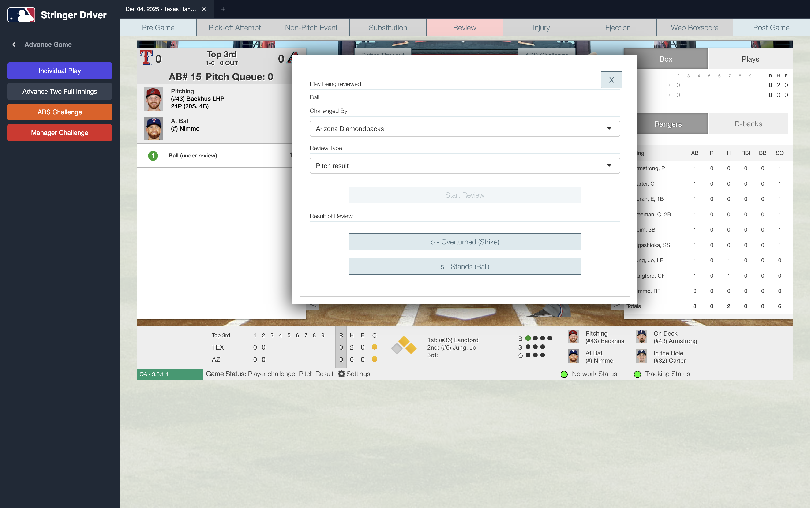

# Stringer Driver 

An Electron desktop application to simultaneously display and drive the "Stringer" MLB web application.

## Overview

This app wraps the Stringer web app in a desktop frame, adding automation capabilities to streamline testing and simulation workflows. It allows for managing multiple game sessions via tabs and provides a suite of automation tools to advance the game state.

## Features

-   **Multi-Tab Interface**: Manage multiple Stringer game sessions simultaneously.
-   **Automation Control**:
    -   **Initial Setup**: Automate pre-game configuration.
    -   **Advance Game**: Tools to fast-forward the game.
        -   **Individual Play**: Trigger specific plays (Strikeout, Walk, Hit, Out, etc.).
        -   **Advance Two Full Innings**: Quickly simulate game progress.
        -   **Challenges**: Trigger ABS and Manager challenges.
-   **Developer Tools**: Inspect app elements directly from the driver.

## Screenshots

<p align="center">
  
  
  
</p>

## Documentation

-   [Development Guide](docs/DEVELOPMENT.md): Setup, architecture, and contribution.
-   [User Guide](docs/USAGE.md): How to use the application and its features.

## Quick Start

```bash
npm install
npm run dev
```